# rip++ writeup

author: Guil-T

## background

[elf binary](./rip++) is provided and asked if can find the flag. Some blah blah about signals and VMs.

## initial execution and reversing

Executing the binary, one can see a typical crackme where its asking for a password and then doing a bunch of crap and then telling if you got it right or not.

```
./rip++ 
Enter the input:abcdqazxswedcvfr
WRONG INPUT
```

## setting up for static and dynamic analysis

1. disable aslr on your linux box so things stop moving and you can sync the base adress with ida pro.

```bash
sudo sysctl -a | grep random
sudo sysctl kernel.randomize_va_space=0
```

2. install build-essentials, gdb and pwndebug

3. in gdb, use `vmmap` to find the base address of your program and set it in ida pro. This will ensure the addresses you see in ida match the ones you see in gdb.

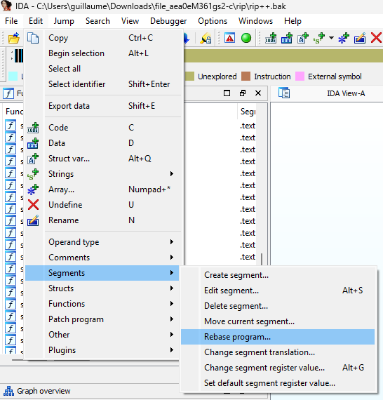


The binary has no symbols and requires some time to name things using IDA.

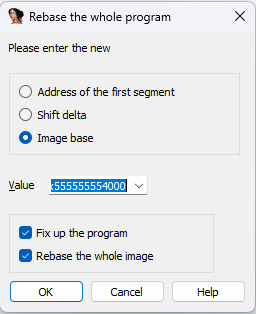

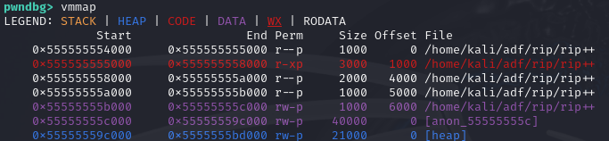

## start the re process

Now the fun begins...

After some initial reversing of the main funtion, you can see its ingesting the password using scanf for a 16byte long string, it initializes the vm memory with some stuff and then compares the password with 16. if different than 16, it bails with "invalid input length". Otherwise it keeps executing.

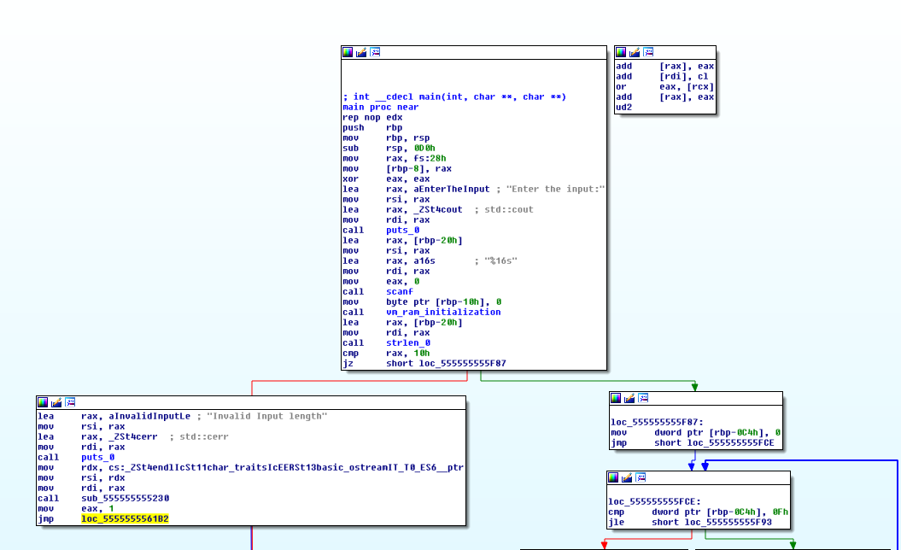

to the right you can see the copying of the password into a region of memory [unk_55555555B280 + 0xb00b*4] with the address now renamed `vm_ram`.

to the left, you can see the setup of the signal based vm where its registering the `vm_cpu` function using `sigaction` to handle signal 4 which is the signal number of SIGILL triggered when an illegal instruction is executed.

After this setup, we can see a conditional branch that is always taken that jumps straight into a deadend block holding insturction `ud2`. Turns out this instruction is illegal and is used to trigger the vm_cpu function via the SIGILL signal.

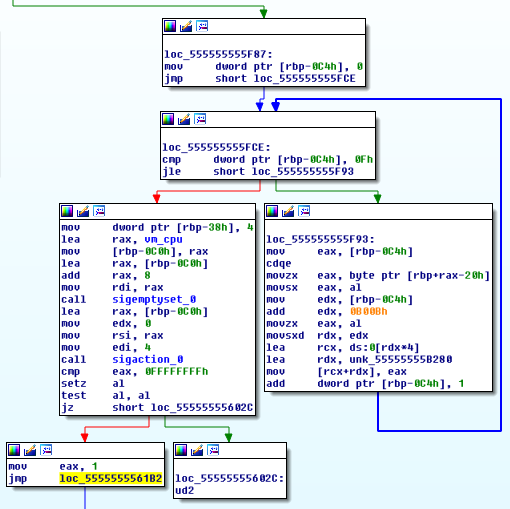

Lets now have a quick glance at the vm_ram_initialization function before moving to the vm_cpu function.

We can see a dictionary of characters is loaded at vm_ram+0x1337*4 in the rightmost block.

**Note: notice how the lowercase `g` is missing in the dictionary** Probably just a typo from the author making the letter g illegal and pretty much crashing the binary if used.

Also interesting is we see what looks like the cypher being loaded in an stack array in the left block.

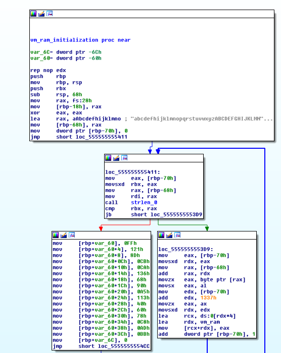

Once done, we can then see this cypher being copied in the vm_ram + 0xc377*4. When done, the initialization of the ram is done.

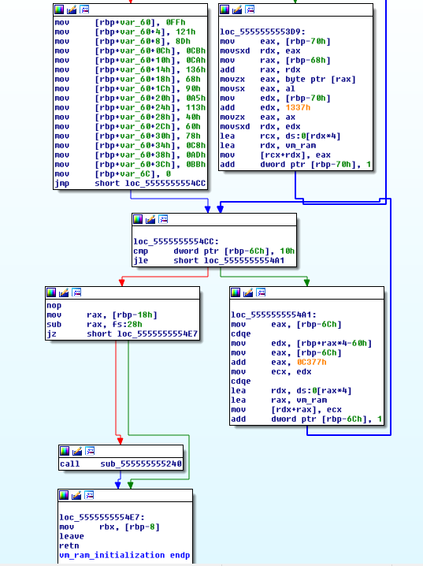

Going back to the main function, lets have a deeper look at this illegal instruction block and see what follows. Pressing the spacebar to go in list mode, it is clear that IDA does not what to make of this so tried to disassemble a bit but quickly failed and just left it as raw data..., Lets fix this a bit by just undefining this crap.

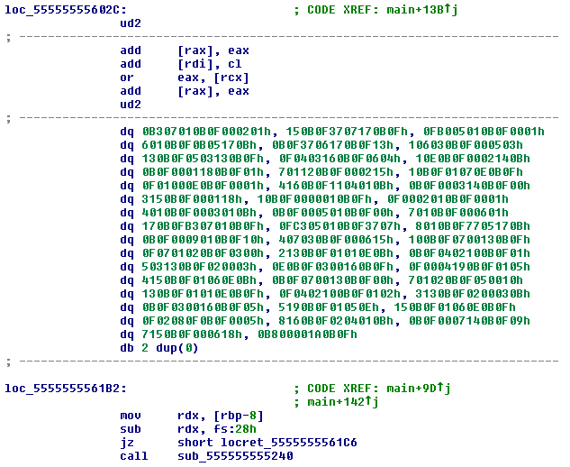


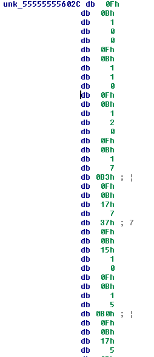

notice how we see 0x0f 0x0b  or 0x0b0f every 5 bytes...looks like the mechanism to trigger the vm_cpu and the three bytes are the machine code of the vm. Some work later you can get something like this...

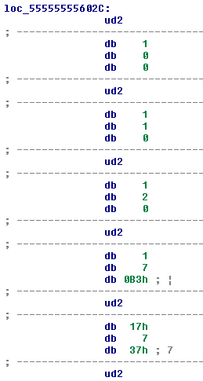

Now lets go look at the vm_cpu function... you might have to tell ida to analyse it by pressing `p`. Its the function at address 0x5555555554ed.

right below the prologue, we can see that its making some checks on the variable at `rbp-53h` and leading to "illegal Opcode message"... lets rename this as the opcode. (use the `k` key to make it a stack variable and then the `n` key to rename it opcode)

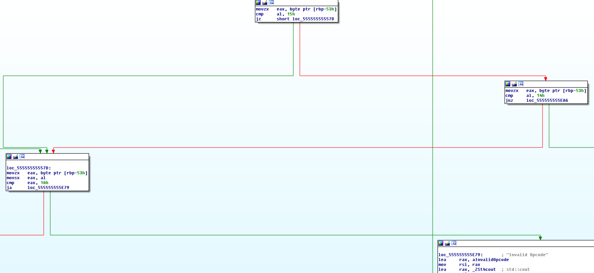

After some renaming and reading about the arguments passed when a handler is called, you can see that it loads the opcode from something deep in the context (ctx) passed to the handler. After the opcode is loaded we can see two more values are loaded in variables. Those are the two operands to the instructions.

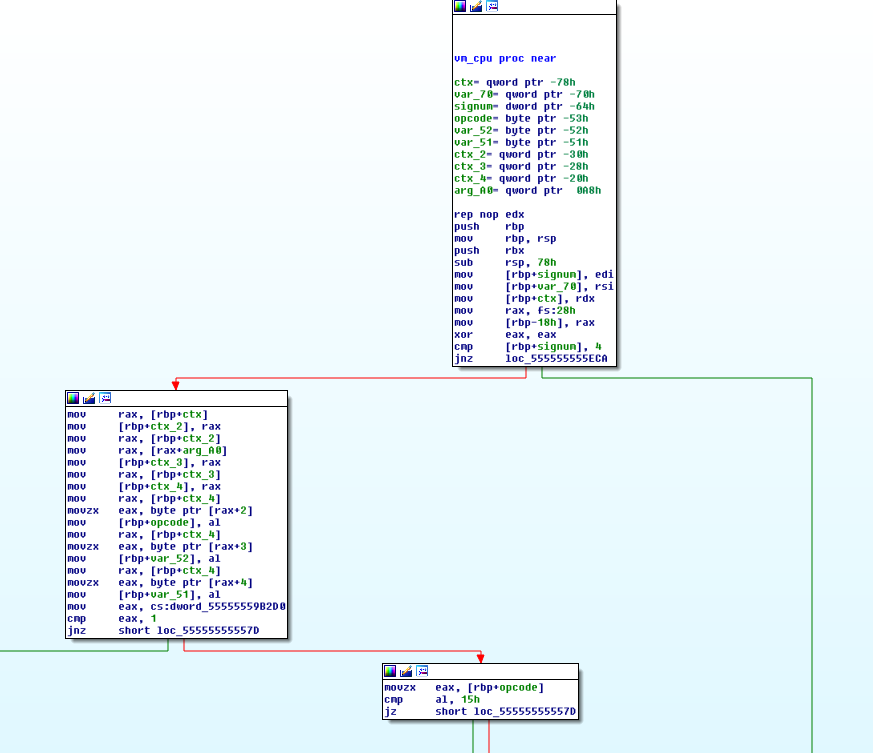

when tracing the checks on the opcode, you see that it leads to a jump vector just like a case statement would be compiled to. Based on the opcode it will jump to an offset in the jmp table...

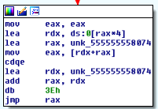

At this point, were ready to reverse the meaning of each opcode by executing the program in gdb until the opcode is loaded and then looking to where it jumps and reverse the code for each instruction.

Also, I copied the bytes of the vm program into an excel sheet so that I can work a poor mans disassembler as I figure out the code.

At this point, I assume you know debugging so here is my best effort at understanding the program in this excel [vm_disassembly.xlsx](vm_disassembly.xlsx). I always use the same method when doing those by using some simple lookup tables for the instructions...

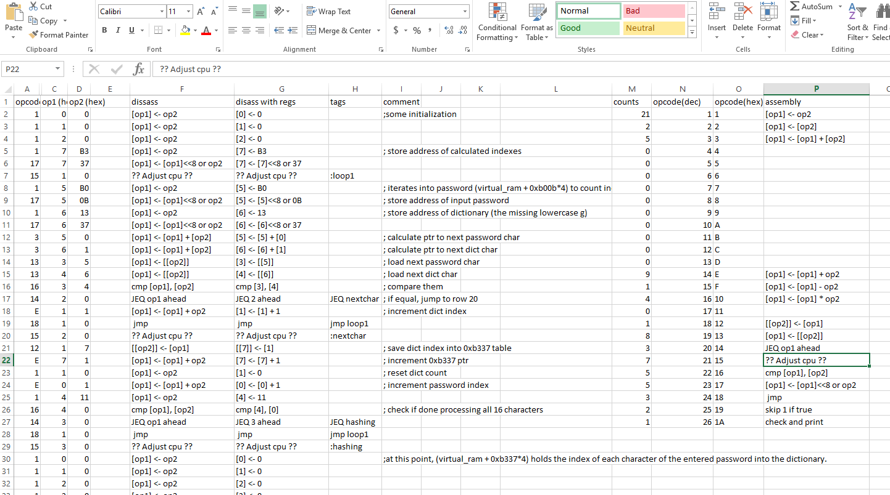

Now reverse this algorithm to figure out how the password is checked against the cypher. See my comments in the excel sheet.

### Some tips on debugging.

sometimes you need to execute loops in the pseudocode and it involves hitting many instructions. This gets old quick so you can do multiple commands in gdb like so `python [gdb.execute('c') for x in range(12)]`

You can also tell gdb not to catch the SIGILL. Just google this.

Avoid getting bogged down on weird instructions like the jumps. you can just figure those out by debugging the pseudocode. I still do not really get how the jumps work but know where they ended up executing the pseudocode...

## cracking the password

At this point, we can now reverse the algorithm and crack the password using a python script.

```python
#!/usr/bin/env python

cypher = [0xff,0x121,0x8d,0xcb,0xca,0x136,0x68,0x90,0xa5,0x113,0x40,0x60,0x78,0xc8,0xad,0xbb]

alphabet = b"abcdefhijklmnopqrstuvwxyzABCDEFGHIJKLMNOPQRSTUVWXYZ1234567890_"

# find valid character combos
password = ''
for i in range(0,len(cypher),2):
    comb = []
    for a in range(len(alphabet)):
        for b in range(len(alphabet)):
            if (a*3 + b*4) == cypher[i] and (a*5 + b*4) == cypher[i+1]:
                password += chr(alphabet[a])
                password += chr(alphabet[b])

print(password)
```

Finally do not forget the final satisfaction

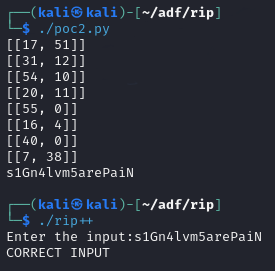

Bingo! took me a whole day...